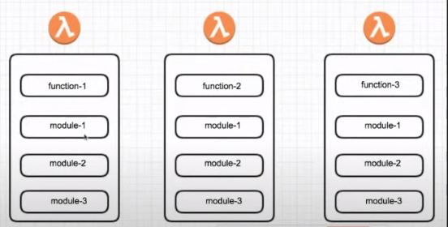
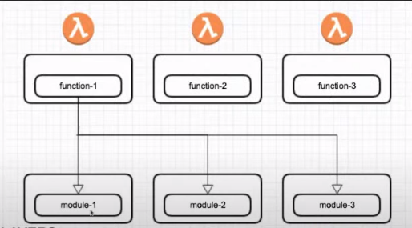

# Welcome to your CDK TypeScript project!

The `cdk.json` file tells the CDK Toolkit how to execute your app.

In this project I practice `Lambda layer`.

### Why Lambda Layer?
 Lambda layer help us to avoid code duplication in lambda environment and make reusability easy in lambda service.
 
 ### comparison

 ## Lambda Functions Without using Lambda Layer
 

  ## Lambda Functions With using Lambda Layer
 

## Useful commands

 * `npm run build`   compile typescript to js
 * `npm run watch`   watch for changes and compile
 * `npm run test`    perform the jest unit tests
 * `cdk deploy`      deploy this stack to your default AWS account/region
 * `cdk diff`        compare deployed stack with current state
 * `cdk synth`       emits the synthesized CloudFormation template
